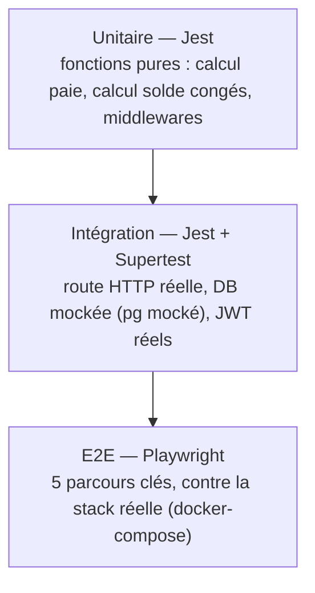

# Plan de tests — HRFlow

**Date** : 24 juillet 2026 · Item "Rédaction du plan de tests" de la grille Jour 2, suite de
`docs/audit-J1-equipe-entrante.md` et `docs/RAPPORT-ETAT-CORRECTIONS.md`.

## Objectif

Documenter la stratégie de test avant de l'implémenter : quels niveaux, quels scénarios sont
critiques, avec quels outils, et quel seuil de sortie. Ce document est écrit en premier ; l'état
réel de son exécution (nombre de tests, coverage effectif, résultats) est reporté dans
`docs/RAPPORT-ETAT-CORRECTIONS.md` au fur et à mesure — pas ici, pour ne pas avoir deux sources de
vérité qui divergent.

## Pyramide de tests retenue

- **Unitaire** : logique métier isolée (calcul de cotisations, majoration heures sup, calcul de
  solde de congés, middlewares `requireAdmin`/`requireAuth`). Rapide, pas de dépendance externe.
- **Intégration** : chaque service Express testé via Supertest, requêtes HTTP réelles contre
  l'`app` exportée, mais `pg` mocké (`jest.mock('pg', ...)`) — on vérifie le contrat HTTP
  (statuts, corps de réponse, requêtes SQL envoyées) sans dépendre d'un vrai Postgres. C'est le
  choix déjà en place depuis la Phase 2 et il est conservé : rapide, déterministe, pas de service
  externe nécessaire en CI.
- **E2E** : contre la stack réelle assemblée par `docker-compose.yml` (Postgres réel inclus),
  parcours utilisateur complets à travers le vrai gateway, les vrais services, et pour certains
  scénarios le vrai frontend buildé. C'est le seul niveau qui aurait attrapé le bug de
  `pathRewrite` manquant (404 sur toute route proxyée depuis 2021) et le bug d'URL relative du
  Dashboard — les deux ont été trouvés en testant l'app pour de vrai en Phase 2, pas par les tests
  unitaires.

## Scénarios critiques identifiés

| # | Scénario | Niveau | Pourquoi il est critique |
|---|---|---|---|
| 1 | Login avec identifiants valides → JWT signé avec le bon rôle | Intégration | Racine de toute l'authentification ; régression = accès total bloqué ou usurpation de rôle |
| 2 | Login avec mot de passe/email invalide → 401, pas de fuite d'info | Intégration | Sécurité — ne doit jamais indiquer si l'email existe |
| 3 | Injection SQL sur l'email de login | Intégration | Vulnérabilité corrigée en Phase 1 (requête paramétrée) — régression = faille critique réintroduite |
| 4 | `/paie/migrate` et `/conges/debug/all` sans token / avec token non-admin | Intégration | Cause racine du post-mortem P1 du 14/15 août 2024 — non-régression obligatoire |
| 5 | Calcul du solde de congés (acquis - pris) | Unitaire/Intégration | Donnée directement visible par tout salarié, erreur = confiance rompue |
| 6 | Calcul de la majoration heures supplémentaires (25%) | Unitaire | Fix Phase 1 (`fix(paie): calcul heures supplémentaires manquant`) — impact direct sur la paie versée |
| 7 | Échec Stripe sur `/paie/calculer` n'empêche pas la génération du bulletin | Intégration | Comportement actuel (erreur avalée) documenté comme risque connu, pas encore corrigé — testé tel quel pour ne pas le casser silencieusement plus tard |
| 8 | Toute route protégée du gateway sans token → 401 | Intégration + E2E | Défense en profondeur ; le gateway est le seul rempart si un service backend est exposé directement |
| 9 | Connexion réussie côté UI → redirection dashboard + solde affiché | E2E | Parcours utilisateur n°1 ; a été cassé en prod par le bug `pathRewrite` |
| 10 | Connexion échouée côté UI → message d'erreur, pas de redirection | E2E | Évite un dashboard vide/cassé silencieux (symptôme du bug d'URL relative trouvé en Phase 2) |
| 11 | Accès direct à `/dashboard` sans session → renvoi vers le login | E2E | Pas de donnée exposée sans authentification côté client |
| 12 | Parcours recrutement : soumission d'une candidature puis consultation de la liste | E2E (API) | Seul module sans aucune couverture avant ce plan ; upload de fichier notoirement non validé (voir audit) |
| 13 | Parcours congés : demande créée via l'API authentifiée avec le bon nombre de jours calculé | E2E (API) | Traverse gateway → service → DB réelle ; valide le calcul de dates de bout en bout |

## Outils retenus et justification

| Outil | Usage | Pourquoi |
|---|---|---|
| Jest | Runner unitaire + intégration, tous les services backend et le frontend | Déjà en place depuis Phase 2, cohérent avec l'écosystème Node/React existant, pas de raison d'introduire un second runner |
| Supertest | Requêtes HTTP contre l'`app` Express exportée | Standard de facto pour tester des routes Express sans ouvrir de vrai port |
| @testing-library/react | Tests frontend (rendu, interactions) | Déjà en place ; teste le comportement utilisateur plutôt que les détails d'implémentation |
| Playwright | E2E navigateur + requêtes API contre la stack réelle | Retenu plutôt que Cypress : un seul outil pour piloter un vrai navigateur **et** faire des requêtes HTTP directes (scénarios 12/13), déjà utilisé manuellement en Phase 2 pour diagnostiquer les deux bugs de production — connu et éprouvé sur ce projet |
| Trivy | Scan de vulnérabilités des images Docker (stage Sécurité, item CI suivant) | Scanner d'images le plus utilisé en CI, gratuit, action GitHub officielle |
| OWASP ZAP (baseline) | Scan dynamique de l'API exposée (stage Sécurité) | Complète Trivy (statique/images) par une vérification dynamique du comportement HTTP réel |

## Critère de sortie

- Coverage backend ≥ 80% (lignes) sur chaque service testé — mesuré via `jest --coverage`,
  seuil appliqué en CI (`coverageThreshold` dans la config Jest de chaque service).
- Au moins 5 scénarios E2E Playwright passants contre la stack `docker-compose` réelle.
- Stage `test` du pipeline affiche le rapport de coverage ; stage `security` inclut Trivy et ZAP
  en plus de `npm audit` déjà en place.

## Hors périmètre de ce plan (limites assumées)

- Tests de charge/performance — non demandés, non couverts.
- Tests de migration de schéma — il n'existe aucune migration versionnée dans le repo
  (voir `docs/architecture.md`).
- Coverage frontend au niveau composant exhaustif — seuls Login et Dashboard existent
  aujourd'hui ; les tests frontend restent ceux de la Phase 2, pas étendus ici.
